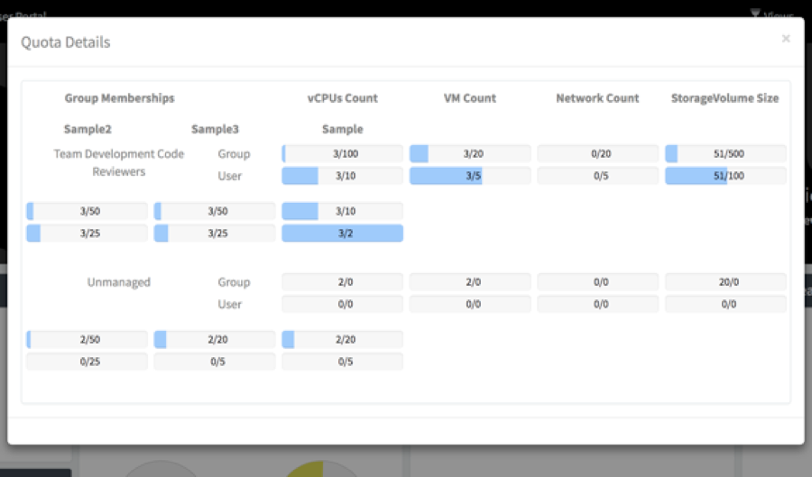
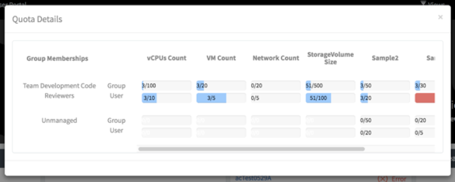

## Fix for Quota Details Pop-up Display for Cloud User Portal [Prototype Only]
###### Solution Category: Fix
Fix formatting issues with the Cloud User Portal Quota Details pop-up window to accommodate greater than 4 quotas in a user-readable layout. The Quota Details pop-up OOB (out-of-the-box) display wraps additional quotas in accordance with its bootstrap container layout which makes the default display not readable to the user when there are more than 4 quotas. This solution formats the Quota Details pop-up layout into a horizontally scrollable table across X number of quotas intended to present a more user-friendly interface.

##### _Alert: This solution requires the modification of OOB code. Take this into consideration when implementing for upgrade scenarios._

###### Examples:
###### Before - Default OOB Display Not Readable for 4+ Quotas

###### After - User-Friendly Horizontally Scrollable Table Format for 4+ Quotas

## ServiceNow Release

This solution was initially created on Kingston Patch 7.

## Prerequisites

Jakarta and above Cloud Management (CMP V2) application is activated.

## Installation Steps
##### _Alert: This solution requires the modification of OOB code. It is recommended to take a backup of the current environment before executing the installation steps._

There is one update set to:

1. Modify the following OOB “Cloud Quota Chart Popup” widget design components to redesign the pop-up display into a horizontally scrollable table:
	* HTML Template
	* CSS - SCSS
	* Client Script
2. This solution also includes a product fix to the Client Script for calculating the colored progress bars; OOB the progress colors do not exist.

Once the update set has been applied, the Cloud User Portal Quota Details pop-up window will display in a horizontally scrollable format to present a user-friendly view of additional custom quotas added to the system.

Note: This solution is pending a) fix to center the numbers within the progress bar (right now the numbers are positioned within the progress bar in-line with the % used) and b) addition of a vertical scroll to accommodate for vertical layout considerations when necessary for X number of membership groups.

Filename: Custom Cloud Quota Details Popup Fix_UpdateSet_vNN.xml

## Documentation

Refer to the Quota Details Popup Fix \[Prototype Only\]_HowToSteps_vNN.pdf document as additional how-to reference on manually configuring this solution.

## Disclaimer
This is not an officially supported solution by ServiceNow.

## Authors

* Annie Chan

## Maintainers/Sponsors

Current maintainers:

* [Annie Chan](https://github.com/sn-achan)
